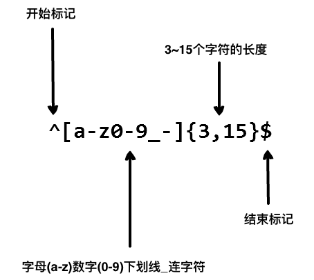

# 正则表达式

一个正则表达式（$\texttt{Regular expression, 简称 regex/regexp}$）是一种从左到右匹配主题字符串的模式。其可以从一个基础字符串中根据一定的匹配模式替换文本中的字符串、验证表单、提取字符串等。

## 1. 基本匹配

正则表达式其实就是在执行搜索时的格式，它由一些字母和数字组合而成。例如：一个正则表达式`the`，它表示一个规则。由字母`t`开始，接着就是`h`，再接着是`e`。
$$
\begin{align}
\texttt{the} \Rightarrow \texttt{The fat cat sat on \textcolor{#0d98ba}{the} mat.}
\end{align}
$$
由于正则表达式对于大小写敏感，所以`The`不会匹配到`the`上：
$$
\begin{align}
\texttt{The} \Rightarrow \texttt{\textcolor{#0d98ba}{The} fat cat sat on the mat.}
\end{align}
$$

## 2. 元字符

正则表达式主要依赖于元字符。元字符不代表他们本身的字面意思，他们均含有特殊的含义，一些元字符卸载方括号中的时候有一些特殊的意思。以下是一些元字符的介绍：

|       元字符       | 描述                                                         |
| :----------------: | ------------------------------------------------------------ |
|        $.$         | 匹配任意单个字符除了换行符。                                 |
|        $[]$        | 字符种类。匹配方括号内的任意字符。                           |
|     $[\land]$      | 否定的字符种类。匹配除了方括号里的任意字符。                 |
|        $*$         | 匹配 $\geq0$ 个重复的在*号前的字符。                         |
|        $+$         | 匹配 $\geq1$ 个重复的在+号前的字符。                         |
|        $?$         | 标记 ? 之前的字符为可选。                                    |
| $\texttt{\{n,m\}}$ | 匹配 $\texttt{num}$ 个大括号之前的字符或字符集（$\texttt{n}\leq\texttt{num}\leq\texttt{m}$）。 |
|  $\texttt{(xyz)}$  | 字符集，匹配与$\texttt{xyz}$完全相等的字符串。               |
|        $|$         | 或运算符，匹配符号前或后的字符。                             |
|    $\backslash$    | 转义字符，用于匹配一些保留的字符$\texttt{[] () \{\} . * + ? }{\land}\texttt{ \$ \\ \|}$。 |
|      $\land$       | 从开始行开始匹配。                                           |
|        $\$$        | 从末端开始匹配。                                             |

### 2.1. 点运算符：$\texttt{.}$

$\texttt{.}$是元字符中最简单的例子。$\texttt{.}$匹配任意单个字符，但不匹配换行符。例如，表达式`.ar`匹配一个任意字符后面跟着的是`a`和`r`的字符串。
$$
\begin{align}
\texttt{.ar} \Rightarrow \texttt{The \textcolor{#0d98ba}{car} \textcolor{#0d98ba}{par}ked in the \textcolor{#0d98ba}{gar}age.}
\end{align}
$$

### 2.2. 字符集

字符集也叫做字符类。方括号用来指定一个字符集。在方括号中使用连字符来指定字符集的范围，且字符集中并不关心顺序。例如，表达式`[Tt]he`可以匹配`The`和`the`：
$$
\begin{align}
\texttt{[Tt]he} \Rightarrow \texttt{\textcolor{#0d98ba}{The} car parked in \textcolor{#0d98ba}{the} garage.}
\end{align}
$$
需要注意的是，`[.]`表示的就是句号。表达式`ar[.]`匹配`ar.`字符串：
$$
\begin{align}
\texttt{ar[.]} \Rightarrow \texttt{A garage is a good place to park a c\textcolor{#0d98ba}{ar.}}
\end{align}
$$

#### 2.2.1. 否定字符集

一般来说`^`表示一个字符串的开头，但它用在一个方括号的开头的时候，它表示这个字符集是否定的。例如，表达式`[^c]ar`匹配一个除了`c`的且后面跟着`ar`的任意字符串：
$$
\begin{align}
\texttt{[}\land\texttt{c]ar} \Rightarrow \texttt{The car \textcolor{#0d98ba}{par}ked in the \textcolor{#0d98ba}{gar}age.}
\end{align}
$$

### 2.3. 重复次数

后面跟着元字符`+`，`*`和`?`的，用来指定匹配子模式的次数。这些元字符在不同的情况下有着不同的意思。

#### 2.3.1. 符号$\texttt{*}$

$\texttt{*}$号匹配在$\texttt{*}$之前的字符出现大于等于$0$次。例如，表达式`a*`匹配$0$或更多个以$\texttt{a}$开头的字符。表达式`[a-z]*`表示匹配一个行中所有以小写字母开头的字符串：
$$
\begin{align}
\texttt{[a-z]*} \Rightarrow \textcolor{#0d98ba}{\underline{\texttt{The}}} \textcolor{#0d98ba}{\underline{\texttt{car}}}\texttt{ } \textcolor{#0d98ba}{\underline{\texttt{parked}}}\texttt{ }\textcolor{#0d98ba}{\underline{\texttt{in}}}\texttt{ }\textcolor{#0d98ba}{\underline{\texttt{the}}}\texttt{ }\textcolor{#0d98ba}{\underline{\texttt{garage}}}\texttt{ }\texttt{ \#21.}
\end{align}
$$
$\texttt{*}$字符和$\texttt{.}$字符搭配可以匹配所有的字符$\texttt{.*}$。$\texttt{*}$和表示匹配空格的符号`\s`连起来用，如表达式`\s*cat\s*`匹配$0$或更多个空格开头和$0$或更多个空格结尾的$\texttt{cat}$字符串。
$$
\begin{align}
\backslash\texttt{s*cat}\backslash\texttt{s*} \Rightarrow \texttt{The fat} \textcolor{#0d98ba}{\underline{{\texttt{ cat }}}} \texttt{sat on the con}\textcolor{#0d98ba}{\underline{{\texttt{cat}}}}\texttt{enation.}
\end{align}
$$

#### 2.3.2. 符号$\texttt{+}$

$\texttt{+}$号匹配$\texttt{+}$号之前的字符出现$\geq1$次。例如表达式`c.+t`匹配以首字母`c`开头以`t`结尾，中间跟着至少一个字符的字符串：
$$
\begin{align}
\texttt{c.+t} \Rightarrow \texttt{The fat }\textcolor{#0d98ba}{\underline{\texttt{cat sat on the mat}}}\texttt{.}
\end{align}
$$

#### 2.3.3. 符号$\texttt{?}$

在正则表达式中元字符$\texttt{?}$标记在符号前面的字符为可选，即出现$0$或$1$次。例如，表达式`[T]?he`匹配字符串`he`和`The`：
$$
\begin{align}
\texttt{[T]?he} \Rightarrow {\textcolor{#0d98ba}{\underline{\texttt{The}}}}\texttt{ car is parked in t}\textcolor{#0d98ba}{\underline{\texttt{he}}}\texttt{ garage.}
\end{align}
$$

### 2.4. $\texttt{\{\}}$量词

在正则表达式中$\texttt{\{\}}$是一个量词，常用来限定一个或一组字符可以重复出现得到次数。例如，表达式`[0-9]{2,3}`匹配最少$2$位最多$3$位的$0\sim9$的数字字符串：
$$
\begin{align}
[0-9]\{2,3\} \Rightarrow \texttt{The number was 9.}\textcolor{#0d98ba}{\underline{\texttt{999}}}\texttt{7 but we rounded it off to }\textcolor{#0d98ba}{\underline{\texttt{10}}}\texttt{.0.}
\end{align}
$$
可以省略第二个参数。 例如，`[0-9]{2,}`匹配至少两位$0\sim9$的数字：
$$
\begin{align}
[0-9]\{2,\} \Rightarrow \texttt{The number was 9.}\textcolor{#0d98ba}{\underline{\texttt{9997}}}\texttt{ but we rounded it off to }\textcolor{#0d98ba}{\underline{\texttt{10}}}\texttt{.0.}
\end{align}
$$
如果逗号也省略掉则表示重复固定的次数。例如，`[0-9]{3}`匹配三位$0\sim9$的数字字符串：
$$
\begin{align}
[0-9]\{3\} \Rightarrow \texttt{The number was 9.}\textcolor{#0d98ba}{\underline{\texttt{999}}}\texttt{7 but we rounded it off to }\texttt{10.0.}
\end{align}
$$

### 2.5. $(\cdots)$特征标群

特征标群是一组写在$(\cdots)$中的子模式。$(\cdots)$中包含的内容将会被看成一个整体，和数学中小括号$()$的作用相同。例如，表达式`(ab)*`匹配连续出现$0$或更多个`ab`。如果没有使用$(\cdots)$，那么表达式`ab*`将匹配连续出现$\geq0$个`b`。再比如之前说的$\{\}$是用来表示前面一个字符出现指定次数。但如果在$\{\}$前加上特征标群$(\cdots)$则表示整个标群内的字符重复$N$次：
$$
\begin{align}
\texttt{(c|g|p)ar} \Rightarrow \texttt{The }\textcolor{#0d98ba}{\underline{\texttt{car}}}\texttt{ is }\textcolor{#0d98ba}{\underline{\texttt{par}}}\texttt{ked in the }\textcolor{#0d98ba}{\underline{\texttt{gar}}}\texttt{age.}
\end{align}
$$

### 2.6. $|$ 或运算符

或运算符就表示或，用作判断条件。例如，`(T|t)he|(c|p)ar`匹配`(T|t)he`或`(c|p)ar`：
$$
\begin{align}
\texttt{(T|t)he|(c|p)ar} \Rightarrow \textcolor{#0d98ba}{\underline{\texttt{The}}}\texttt{ }\textcolor{#0d98ba}{\underline{\texttt{car}}}\texttt{ is }\textcolor{#0d98ba}{\underline{\texttt{par}}}\texttt{ked in }\textcolor{#0d98ba}{\underline{\texttt{the}}}\texttt{ }\texttt{garage.}
\end{align}
$$

### 2.7. 转码特殊字符

反斜线$\backslash$在表达式中用于转码紧跟其后的字符。用于指定$\texttt{\{\} [] / }{\backslash}\texttt{ + * . \$ }{\land}\texttt{ | ?}$这些特殊字符，如果想要匹配这些特殊字符则要在其前面加上反斜线$\backslash$。例如，$.$是用来匹配除换行符外的所有字符的，如果想要匹配句子中的$.$则要写成`\.`以下这个例子`\.?`表示的是选择性匹配`.`：
$$
\begin{align}
\texttt{(f|c|m)at}{\backslash}\texttt{.?} \Rightarrow \texttt{The }\textcolor{#0d98ba}{\underline{\texttt{fat}}}\texttt{ }\textcolor{#0d98ba}{\underline{\texttt{cat}}}\texttt{ sat on the }\textcolor{#0d98ba}{\underline{\texttt{mat.}}}
\end{align}
$$

### 2.8. 锚点

在正则表达式中，想要匹配指定开头或结尾的字符串就要使用到锚点。$\land$指定开头，$\$$指定结尾：

#### 2.8.1. 符号$\land$

$\land$用来检查匹配的字符串是否在所匹配字符串的开头。在`abc`中使用表达式`^a`会得到结果`a`；但如果使用`^b`将匹配不到任何结果，因为在字符串`abc`中并不是以`b`开头。例如，`^(T|t)he`匹配以`The`或`the`开头的字符串：
$$
\begin{align}
\land\texttt{(T|t)he} \Rightarrow \textcolor{#0d98ba}{\underline{\texttt{The}}} \texttt{ car is parked in the garage.}
\end{align}
$$

#### 2.8.2. 符号$\$$

同理于符号$\land$，符号$\$$用来匹配字符是否是最后一个。例如，`(at\.)$`匹配以`at.`结尾的字符串：
$$
\begin{align}
\texttt{(at}{\backslash}\texttt{.)} &\Rightarrow \texttt{The fat c}\textcolor{#0d98ba}{\underline{\texttt{at.}}}\texttt{ s}\textcolor{#0d98ba}{\underline{\texttt{at.}}}\texttt{ on the m}\textcolor{#0d98ba}{\underline{\texttt{at.}}}\\
\texttt{(at}{\backslash}\texttt{.)\$} &\Rightarrow \texttt{The fat cat. sat. on the m}\textcolor{#0d98ba}{\underline{\texttt{at.}}}\\\\

\end{align}
$$

## 3. 简写字符集

正则表达式提供一些常用的字符集简写。如下：

|      简写      | 描述                                                         |
| :------------: | :----------------------------------------------------------- |
|      $.$       | 匹配除了换行符外的所有字符                                   |
| $\backslash w$ | 匹配所有字母数字，等同于$\texttt{[a-zA-Z0-9]}$               |
| $\backslash W$ | 匹配所有非字母数字，即符号，等同于$\texttt{[}\land\texttt{\\w]}$ |
| $\backslash d$ | 匹配数字，等同于$\texttt{[0-9]}$                             |
| $\backslash D$ | 匹配非数字，等合同于$\texttt{[}\land\texttt{\\d]}$           |
| $\backslash s$ | 匹配所有空格字符，等同于$\texttt{[\\t\\n\\f\\r\\p\{Z\}]}$    |
| $\backslash S$ | 匹配所有非空格字符，等同于$\texttt{[}\land\texttt{\\s]}$     |
| $\backslash f$ | 匹配一个换页符                                               |
| $\backslash n$ | 匹配一个换行符                                               |
| $\backslash r$ | 匹配一个回车符                                               |
| $\backslash t$ | 匹配一个制表符                                               |
| $\backslash v$ | 匹配一个垂直制表符                                           |
| $\backslash b$ | 匹配$\texttt{CR/LF}$等同于$\texttt{\\r\\n}$，用来匹配$\texttt{DOS}$行终止符 |

## 4. 零宽度断言（前后预查）

先行断言和后发断言（合称$\texttt{lookaround}$）都属于非捕获组（用于匹配模式，但不包括在匹配列表中）。当需要一个模式的前面或后面有另一个特定的模式时，就可以使用它们。例如，希望从下面的输入字符串$\$4.44$和$\$10.88$中获得所有以$\$$字符开头的数字，将使用以下的正则表达式`(?<=\$)[0-9\.]*`。意思是，获取所有包含`.`并且前面是`$`的数字。

零宽度断言如下：

|      符号      | 描述             |
| :------------: | ---------------- |
| $\texttt{?=}$  | 正先行断言——存在 |
| $\texttt{?!}$  | 负先行断言——排除 |
| $\texttt{?<=}$ | 正后发断言——存在 |
| $\texttt{?<!}$ | 负后发断言——排除 |

### 4.1. 正先行断言——$\texttt{?=}\cdots$

表示第一部分表达式之后必须跟着$?=\cdots$定义的表达式。返回结果只包含满足匹配条件的第一部分表达式。定义一个正先行断言要使用$()$。在括号内部使用一个问号和等号：$(?=\cdots)$。正先行断言的内容写在括号中的等号后面。例如，表达式$\texttt{(T|t)he[?=\\sfat]}$匹配`The`和`the`，在括号中我们又定义了正先行断言`(?=\sfat)`，即`The`和`the`后面紧跟着`(空格)fat`：
$$
\begin{align}
\texttt{(T|t)he(?=\\sfat)} \Rightarrow \textcolor{#0d98ba}{\underline{\texttt{The}}} \texttt{ fat cat sat on the mat.}
\end{align}
$$

### 4.2. 负先行断言——$\texttt{?!}\cdots$

负先行断言$\texttt{?!}$用于筛选所有匹配结果，筛选条件为：其后不跟随着断言中定义的格式。

负先行断言定义和正先行断言一样，区别就是$=$替换成了$!$，即$\texttt{?!}\cdots$。例如，表达式$\texttt{(T|t)he(?!\\sfat)}$匹配`The`和`the`，且后面不跟着`(空格)fat`：
$$
\begin{align}
\texttt{(T|t)he(?!\\sfat)} \Rightarrow \texttt{The fat cat sat on }\textcolor{#0d98ba}{\underline{\texttt{the}}}\texttt{ mat.}
\end{align}
$$

### 4.3. 正后发断言——$\texttt{?<=}\cdots$

正后发断言$\texttt{?<=}$用于筛选所有匹配结果，筛选条件为：其前跟随着断言中定义的格式。

例如，表达式$\texttt{(?<=(T|t)he\\s)(fat|mat)}$匹配`fat`和`mat`，且其前跟随`The`或`the`：
$$
\begin{align}
\texttt{(?<=(T|t)he\\s)(fat|mat)} \Rightarrow \texttt{The }\textcolor{#0d98ba}{\underline{\texttt{fat}}}\texttt{ cat sat on the }\textcolor{#0d98ba}{\underline{\texttt{mat}}}\texttt{.}
\end{align}
$$

### 4.4. 负后发断言——$\texttt{?<!}\cdots$

负后发断言$\texttt{?<!}$用于筛选所有匹配结果，筛选条件为：其前不跟随着断言中定义的格式。

例如，表达式$\texttt{(?<!(T|t)he\\s)(cat)}$匹配`cat`，且其前不跟随`The`或`the`：
$$
\begin{align}
\texttt{(?<!(T|t)he\\s)(cat)} \Rightarrow \texttt{The cat sat on }\textcolor{#0d98ba}{\underline{\texttt{cat}}}\texttt{.}
\end{align}
$$

## 5. 标志

标志也叫模式修正符，因为它可以用来修改表达式的搜索结果。这些标志可以任意的组合使用，它也是整个正则表达式的一部分。

|     标志     | 描述                                                 |
| :----------: | ---------------------------------------------------- |
| $\texttt{i}$ | 忽略大小写                                           |
| $\texttt{g}$ | 全局搜索                                             |
| $\texttt{m}$ | 多行修饰符：锚点元字符$\land \$$工作范围在每行的起始 |

### 5.1. 忽略大小写（$\texttt{Case Insensitive}$）

修饰标志$\texttt{i}$用于忽略大小写。例如，表达式`/The/gi`表示在全局搜索`The`，且在后面的`i`将其条件修改为忽略大小写，则变成搜索`the`和`The`，`g`则表示全局搜索：
$$
\begin{align}
\texttt{The} &\Rightarrow \textcolor{#0d98ba}{\underline{\texttt{The}}}\texttt{ fat cat sat on the mat.}\\

\texttt{/The/gi} &\Rightarrow \textcolor{#0d98ba}{\underline{\texttt{The}}}\texttt{ fat cat sat on }\textcolor{#0d98ba}{\underline{\texttt{the}}}\texttt{ mat.}\\
\end{align}
$$

### 5.2. 全局搜索（$\texttt{Global search}$）

修饰符$\texttt{g}$常用于执行一个全局搜索匹配，即（不仅仅返回第一个匹配的，而是返回全部）。例如，表达式`/.(at)/g`表示搜索任意字符（除了换行符）后跟随`at`，并返回全部结果：
$$
\begin{align}
\texttt{/.(at)/} &\Rightarrow \texttt{The }\textcolor{#0d98ba}{\underline{\texttt{fat}}}\texttt{ cat sat on the mat.}\\

\texttt{/.(at)/g} &\Rightarrow \texttt{The }\textcolor{#0d98ba}{\underline{\texttt{fat}}}\texttt{ }\textcolor{#0d98ba}{\underline{\texttt{cat}}}\texttt{ }\textcolor{#0d98ba}{\underline{\texttt{sat}}}\texttt{ on the }\textcolor{#0d98ba}{\underline{\texttt{mat}}}\texttt{.}\\
\end{align}
$$

### 5.3. 多行修饰符（$\texttt{Multiline}$）

多行修饰符$\texttt{m}$常用于执行一个多行匹配。像之前介绍的`(^,$)`用于检查格式是否是在待检测字符串的开头或结尾。但我们如果想要它在每行的开头和结尾生效，我们需要用到多行修饰符`m`。例如，表达式`/at(.)?$/gm`表示小写字符`a`后跟随小写字符`t`，末尾可选除了换行符外任意字符。根据`m`修饰符，现在表达式匹配每行的结尾：
$$
\begin{align}
\texttt{/.at(.)?\$/} \Rightarrow 
&\texttt{The fat}\\ 
&\texttt{cat sat}\\
&\texttt{on the }\textcolor{#0d98ba}{\underline{\texttt{mat.}}}\\
\end{align}
$$

$$
\begin{align}
\texttt{/.at(.)?\$/gm} \Rightarrow 
&\texttt{The }\textcolor{#0d98ba}{\underline{\texttt{fat}}}\\ 
&\texttt{cat }\textcolor{#0d98ba}{\underline{\texttt{sat}}}\\
&\texttt{on the }\textcolor{#0d98ba}{\underline{\texttt{mat.}}}\\
\end{align}
$$

## 6. 贪婪匹配与惰性匹配（$\texttt{Greedy vs lazy matching}$）

正则表达式默认采用贪婪匹配模型，在该模式下意味着会匹配尽可能长的字串。我们可以使用$\texttt{?}$将贪婪匹配模式转化为惰性匹配模式：
$$
\begin{align}
\texttt{/.*at/} &\Rightarrow \textcolor{#0d98ba}{\underline{\texttt{The fat cat sat on the mat}}}\texttt{.}\\

\texttt{/.*?at/} &\Rightarrow \textcolor{#0d98ba}{\underline{\texttt{The fat}}}\texttt{  cat sat on the mat.}\\
\end{align}
$$
