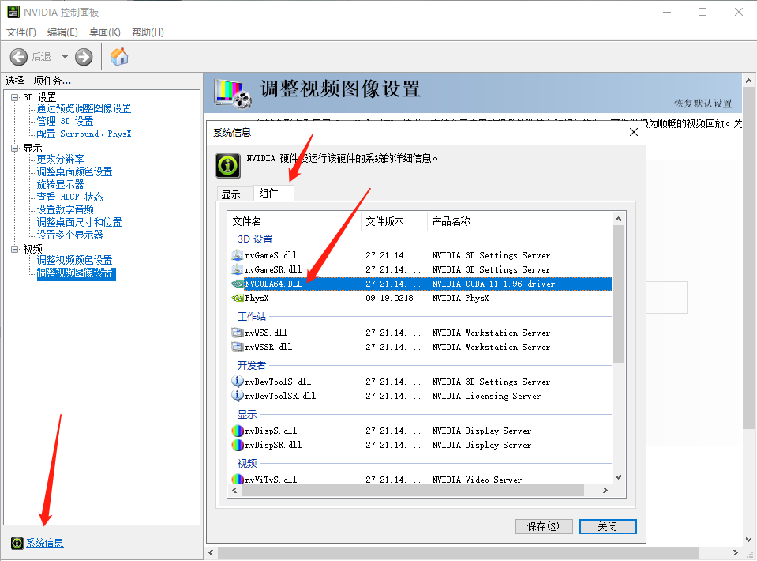
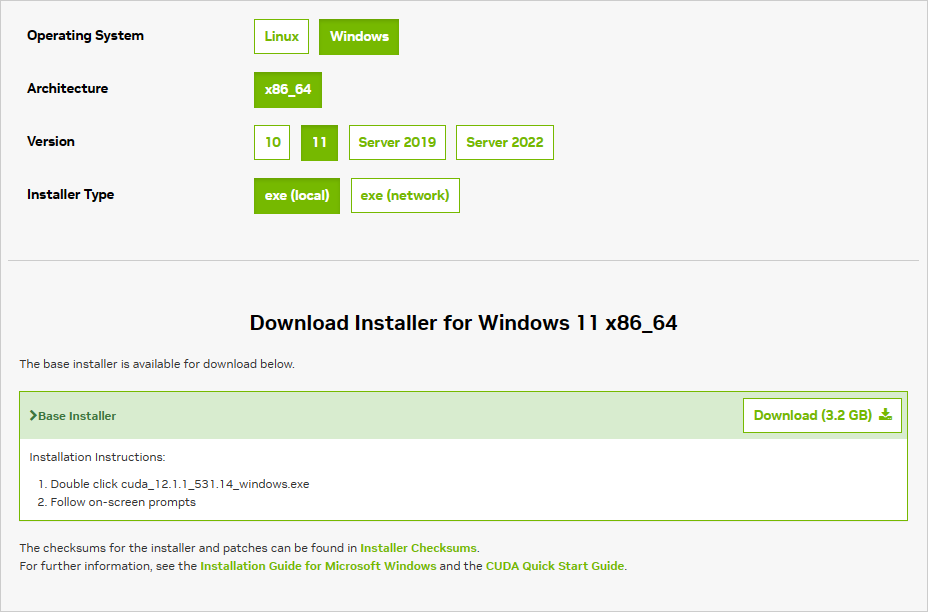

#### Python 换源

|   镜像站名   |                     网址                      |
| :----------: | :-------------------------------------------: |
|     华为     |       https://mirrors.huaweicloud.com/        |
|    阿里云    |    http://mirrors.aliyun.com/pypi/simple/     |
| 中国科技大学 |    http://pypi.mirrors.ustc.edu.cn/simple/    |
|   清华大学   |   https://pypi.tuna.tsinghua.edu.cn/simple/   |
|   浙江大学   |   https://pypi.tuna.tsinghua.edu.cn/simple/   |
|     腾讯     | http://mirrors.cloud.tencent.com/pypi/simple/ |
|     豆瓣     |        http://pypi.douban.com/simple/         |
|     网易     |            http://mirrors.163.com/            |
|     搜狐     |           http://mirrors.sohu.com/            |


#### Windows 配置 CUDA

在电脑桌面，点击**NVIDIA 控制面板**选项。并点击**系统信息**以进行**NVIDIA**显卡的**CUDA**适用版本查看。并通过**组件**中的**NVCUDA64.DLL**中的产品名称，找到合适的**CUDA**版本（如图该机器适用的版本为11.1）。



随后，找到合适自己电脑的**CUDA**版本后，下载对应的**CUDA**（[官网](https://developer.nvidia.com/cuda-downloads)）。选取对应版本，以及操作系统等内容并下载，下载完成后双击安装即可。



安装完成后，在环境变量中添加以下内容：

```python
CUDA_PATH			=	"C:\Program Files\NVIDIA GPU Computing Toolkit\CUDA\v11.1";
CUDA_BIN_PATH		=	"%CUDA_PATH%\bin";
CUDA_LIB_PATH		=	"%CUDA_BIN_PATH%\lib\x64";
CUDA_PATH_NVCC		=	"%CUDA_PATH%\libnvvp";
CUDA_SDK_PATH		=	"C:\ProgramData\NVIDIA Corporation\CUDA Samples\v11.1";
CUDA_SDK_BIN_PATH	=	"%CUDA_SDK_PATH%\bin\win64";
CUDA_SDK_LIB_PATH	=	"%CUDA_SDK_PATH%\common\lib\x64"
```


#### Windows 安装 [torch+cuda](https://download.pytorch.org/whl)

确定需要安装的 [Pytorch](https://download.pytorch.org/whl) 版本，通过下述命令进行 cuda 版本的安装：

```shell
pip3 install torch==1.13.0+cu117 torchvision==0.14.0+cu117 torchaudio===0.13.0+cu117 -f https://download.pytorch.org/whl/cu117/torch_stable.html
```


#### Pyinstaller 用法

| 指令                                 | 作用                                                         |
| ------------------------------------ | ------------------------------------------------------------ |
| -h，--help                           | 查看帮助信息                                                 |
| -F，--onefile                        | 产生单个的可执行文件                                         |
| -D，--onedir                         | 产生一个目录（包含多个文件）作为可执行程序                   |
| -a，--ascii                          | 不包含 Unicode 字符集支持                                    |
| -d，--debug                          | 产生 debug 版本的可执行文件                                  |
| -w，--windowed，--noconsolc          | 指定程序运行时不显示命令行窗口（仅对 Windows 有效）          |
| -c，--nowindowed，--console          | 指定使用命令行窗口运行程序（仅对 Windows 有效）              |
| -o {output_dir}，--out={output_dir}  | 指定 spec 文件的生成目录。如果没有指定，则默认使用当前目录来生成 spec 文件 |
| -p {output_dir}，--path={output_dir} | 设置 Python 导入模块的路径，也可使用路径分隔符（Windows 使用分号，Linux 使用冒号）来分隔多个路径 |
| -n {Name}，--name={Name}             | 指定项目（产生的 spec）名字。如果省略该选项，那么第一个脚本的主文件名将作为 spec 的名字 |

